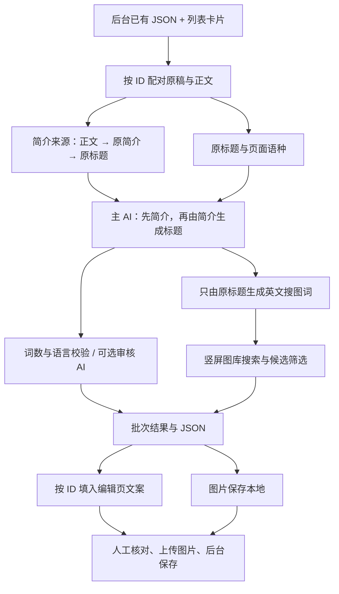
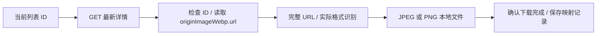

# 锁屏编辑助手

锁屏编辑助手是一个 Chrome / Edge Manifest V3 扩展。它把后台原稿、正文和内容 ID 组织成批次，调用用户配置的独立 AI 生成同语种文案，再搜索竖屏配图。文案按 ID 填回编辑页，图片保存到本地后由编辑上传，最终由编辑核对并保存后台记录。

## 原理与结构

扩展由网页读取层、批次交互层和后台服务层组成。页面负责识别内容与填写字段，悬浮窗维护任务状态，模块型 service worker 处理 AI、图库和文件下载。三层通过扩展消息传递数据。

| 组成 | 实现职责 |
| --- | --- |
| [page-bridge.js](page-bridge.js) | 在网页 MAIN world 观察已有 fetch / XHR 的 JSON 响应，提取 ID、原题、简介与正文，通过同源 postMessage 交给内容脚本。 |
| [content.js](content.js) | 扫描卡片、匹配记录、识别编辑字段，触发表单事件并读回验证。 |
| [assistant.js](assistant.js) | 显示悬浮窗，调度每个标签页的批处理、暂停、重试、导入导出和人工换图。 |
| [background-entry.js](background-entry.js)、[background.js](background.js) | 运行模块型 service worker，接收任务消息并访问 AI、图库和下载接口。 |
| [workflow.js](workflow.js) | 提供多语种计词、来源规则、本地候选、批次命名和 JSON 校验。 |
| [background-ai.js](background-ai.js)、[background-locks.js](background-locks.js) | 提供错误分类、退避和任务串行锁；具体 AI 请求由 background.js 执行。 |
| [background-stock.js](background-stock.js)、[background-downloads.js](background-downloads.js) | 提供图片元数据初筛、搜索词约束、文件格式识别和命名辅助。 |
| [backend-preview.js](backend-preview.js)、[options.js](options.js) | 分别负责后台右侧图片字段解析与 ID 校验，以及接口、模型、密钥和处理规则设置。 |

## 原稿读取与文案生成

页面桥在 document_start 注入，克隆页面原本收到的 JSON 响应进行读取，原响应继续交给网站。内容脚本按照卡片位置编号，再用内容 ID 对齐标题、简介和正文。HTML 正文去除脚本、导航、表单与页脚，缓存最多保存 12,000 字符。

简介来源依次为列表 JSON 正文、文章链接读取的正文、原简介、原标题。发给 AI 的正文最多为 6,000 字符，来源保存为 summarySource。ID 对齐说明字段属于同一记录；同一记录内部原题与正文是否已经错位，仍需人工核对。

主 AI 正常情况下对每条发起一次请求，先生成简介，再仅根据新简介浓缩标题；同次响应返回只根据原标题生成的英文图片关键词。原题和页面语言用于约束输出语种，模型名称按设置原样发送。

标题与简介默认分别限制为 12 词、50 词，上限可调整。计词器先做 Unicode NFC 规范化；带撇号或连字符的书写词按一个词处理，无空格文字使用浏览器 Intl.Segmenter 分词。结果经过词数与语言检查，可再交给独立审核 AI 修改。

本地模式使用规则生成词语候选，不请求 AI，也不自动把外语搜图词译成英文，结果进入人工复核。思考强度、提示词与审核接口通过设置影响请求内容。

## 配图与文件保存

自动配图以原标题为搜索来源。用户在单条配图中输入英文关键词时，系统直接使用这组词搜索；人工关键词选图不会覆盖默认搜索词，翻页沿用产生当前结果的词和图源。

Pexels 为主要图源，Pixabay 为备选，手动搜索还可使用 Openverse。请求参数限制图片方向，返回后再次检查 height > width，并按接近 9:16 或 9:20 的程度选择候选。人物、裸露及特定地区主题由关键词和元数据初筛，无法确认的图片进入人工复核。

素材 ID、标准化 URL 和下载文件的 SHA-256 用于重复识别；手动重复标记和使用记录跨批次保留。下载时固定目标目录，按语言、国家和读取时间命名，并使用 30 / 40 档位分组。

保存前检查实际文件头。JPEG / PNG 保留原文件内容；WebP、AVIF、GIF 使用 createImageBitmap 解码，通过 OffscreenCanvas 编码为 JPEG，后缀与实际格式一致。下载由 chrome.downloads 完成。

## 后台右侧图片的独立链路

后台列表与上传框读取 originImage，编辑页右侧预览读取 originImageWebp.url。因此列表提示“请添加图片”时，右侧字段仍可能有图。

这条链路从当前列表取得 ID，以当前标签页登录态逐条 GET /api/OverseasLockScreen/get?id=…，检查返回 ID 后读取右侧字段。读取和下载最多 4 路并发，文件名包含列表编号、ID 和最新标题；同一素材用于多个条目时分别保存。

右侧图下载独立于 AI 批次和图库用量记录，显示逐条状态与总进度，可以停止并继续下载未成功的图片。记录 JSON 保留 ID、来源 URL、路径和失败原因。

## 任务状态与编辑页写入

批次、暂停状态和处理规则按浏览器启动标识与标签页 ID 隔离，多个标签页可以独立处理。批次保存在 chrome.storage.local，通用设置使用 chrome.storage.sync；接口密钥只存本机，导出 JSON 不含密钥。

每条任务依次进入“读取文章、文案改写、图片搜索”。处理时局部更新卡片与进度，收尾时整体刷新；任务锁和运行标识防止旧任务继续写入新状态。AI 请求区分限流、服务端错误、空响应、截断、超时及配置错误，按类型决定退避、扩大输出预算或停止重试。

编辑页根据 URL 中的 ID 匹配结果。填写前检查词数，写入标题和简介后触发 input / change 事件，再读回字段确认网站已接受。图片上传与后台最终保存由编辑操作；“处理完成”表示扩展生成链路结束，不表示后台记录已保存。
